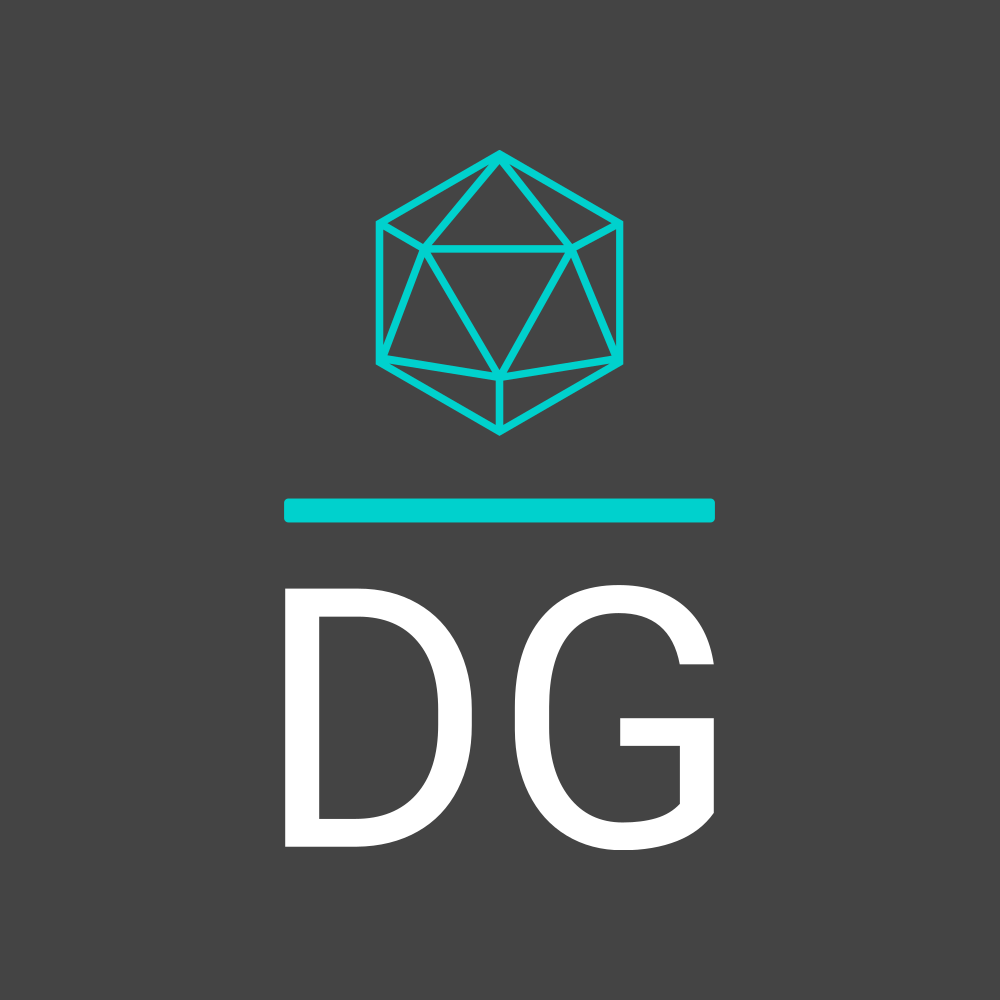

<!--- Header -->

  

    
   

   

     <h1>Hi, My Name is Declan</h1>
  

 
  
 
<!--- Languages and tools -->

  

My current tech stack includes:

  
  
  
  
  
  
  
  
  
  
  
  
  
  
  
  

  
  
  
  
  
  
  
  

  

   

  

  

        My most used languages on Git are:
         
         
        

        
        

  

  

<!--- About me section -->

  <h3> Currently: </h3>
  <ul>
    <li>
      BSc Computer Science Undergraduate at the <a href="https://www.port.ac.uk/">University of Portsmouth</a> September 2020 - June 2023
    </li>
  </ul>

  <h3> Interests </h3>
  <ul>
    <li>Project Management</li>
    <li>Internet of Things</li>
    <li>UX and Accessibility</li>
    <li>Backend Development</li>
    <li>Web Development</li>
    <li>Educational Computing</li>
  </ul>

<h3> Let's Connect <h3>
       
       

